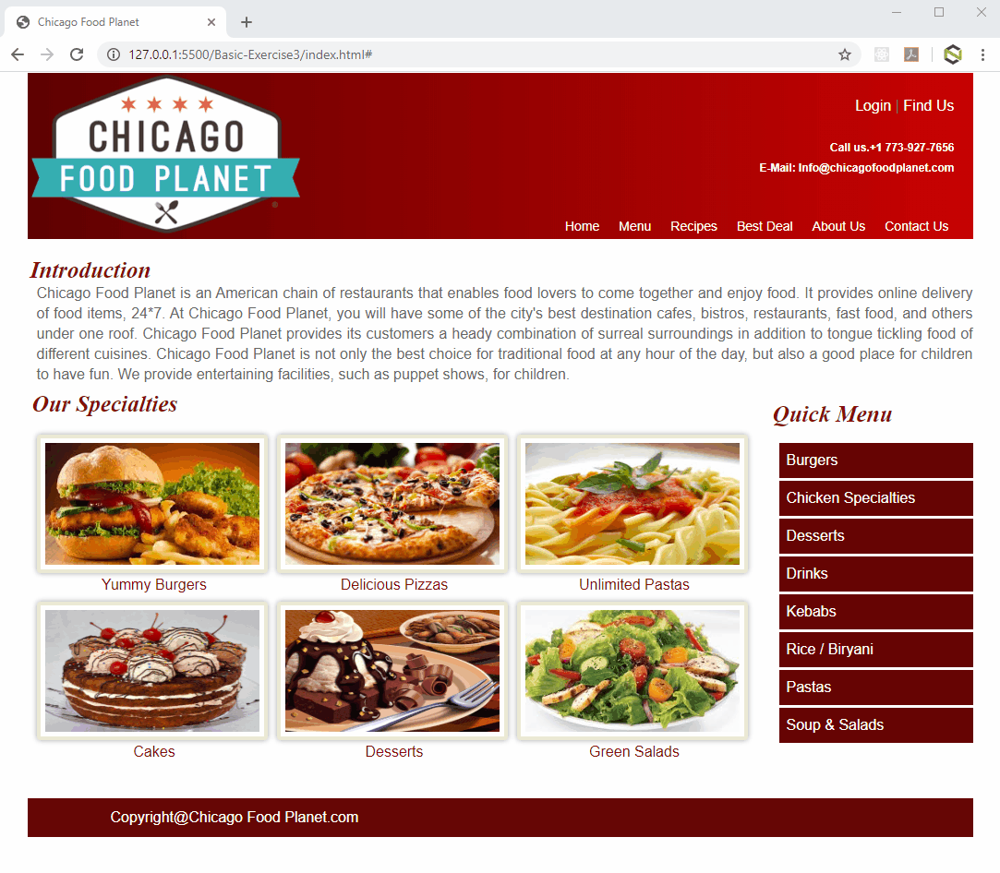

Create an HTML page of Chicago food planet as per the below requirements
- Add the banner on the top of the page which should contain the logo, contact details, menu and Login, Find us link. The backgound of the banner should have the gradient color.
- Add the logo image on the top left side of the page, login and find us link, and display contact details on the right side of the page. All these things should be inside the banner.
- Add hyperlink for the following menu:
    - Home
    - Menu
    - Recipes
    - Best Deal
    - About us
    - Contact Us
The color of the perceding hyperlinks should change to green, when the user hovers the mouse pointer over them. Remove the underline from the hyperlinks using CSS.

- The following text should be displayed below the banner with the heading `Introduction`.

`Chicago Food Planet is an American chain of restaurants that enables food lovers to come together and enjoy food. It provides online delivery of food items, 24*7. At Chicago Food Planet, you will have some of the city's best destination cafes, bistros, restaurants, fast food, and others under one roof. Chicago Food Planet provides its customers a heady combination of surreal surroundings in addition to tongue tickling food of different cuisines. Chicago Food Planet is not only the best choice for traditional food at any hour of the day, but also a good place for children to have fun. We provide entertaining facilities, such as puppet shows, for children.`
- Create an image gallery for varioous dishes with heading `Our Specialities`. Whenever, the user hovers the mouse pointer over the images, a title containing the name of the dish should be displayed.
- Add the images for the available cuisines.
- Add the quick menu as a sidebar.
- The following links should be displayed on the quick menu:
    - Burgers
    - Chicken Specialties
    - Desserts
    - Drinks
    - Kebabs
    - Rice / Biryani
    - Pasta
    - Soup & Salads
- The color of the preceding hyperlinks should change to green & background color to grey, when the user hovers the mouse pointer over them.
- Add a copyright in footer section.
- Finally the page should appear as shown in the following figure.

Note : Use external style sheet for styling
