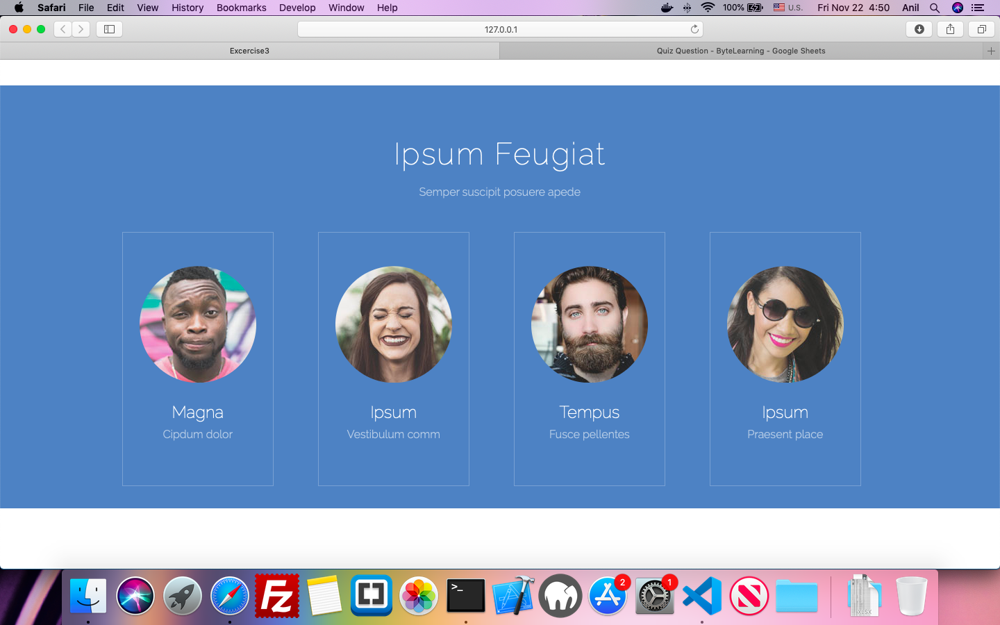

### Objective 
Purpose of this assignment is to improve your web designing skills and use flex layout to create good looking and interactive  web pages.
In order to meet this objective you are suggested to create a one page website to display the profile  dashboard of a company top management , using Html 5 Elements and CSS.

### Task

1. Create a page to display profile dashboard of a company top management.
2. There should be a Company Title and Profile Title (eg.Our executive Directors)
3. Below that the Profile Details of each employee in a row.
4. Each profile will contain an image Name and Designation of employee in sequence.
5. There should be a border for each profile and details should be centre aligned. Use a paper flex    layout 
 
 ### Sample Output

 
 