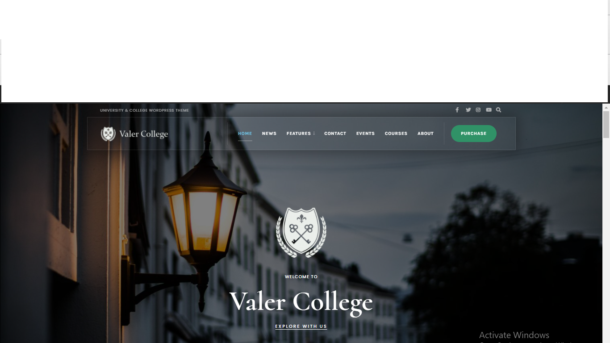
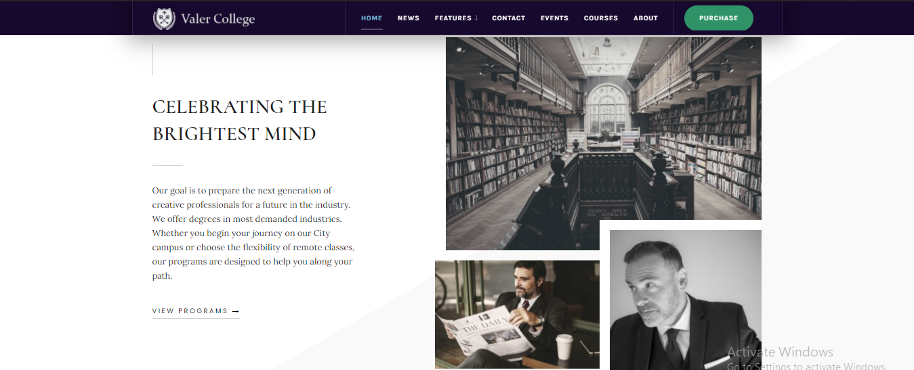
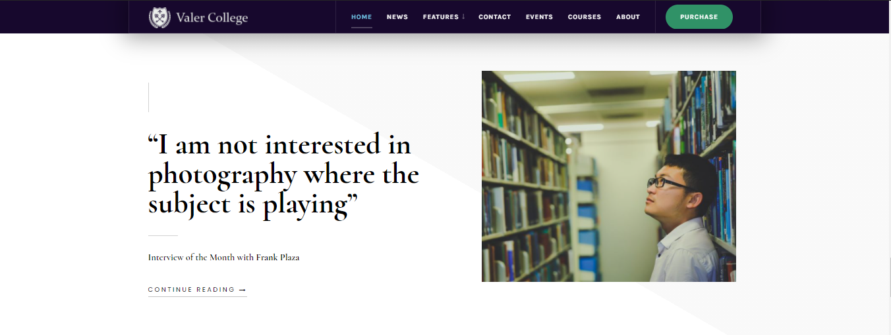
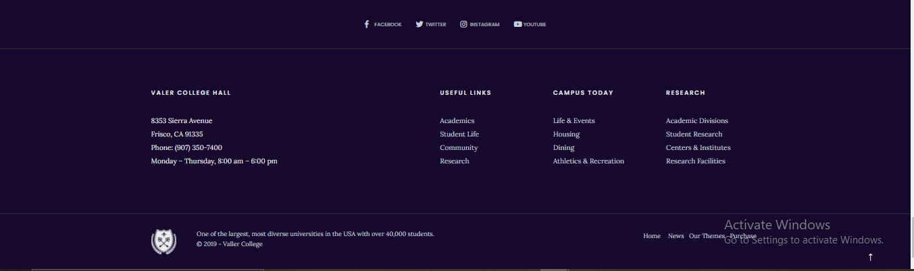

### Objective
Purpose of this assignment is to improve your web designing skills and use flex layout to create good looking and interactive  web pages.
In order to meet this objective you are suggested to create a one page website for Valer College , using Html 5 Elements and CSS.

### Task

The page MUST contain the following elements ...
1. Header with a nav bar
2. 1 column hero unit (Hero section to be full width, edge to edge)
3. A 3 column section
4. A footer. with social media links and site links. (These need not be functional) 

Additional Requirements: 
5. Make use of a google font for displaying text
6. Fixed header with page scroll beneath the header

### Sample Output

